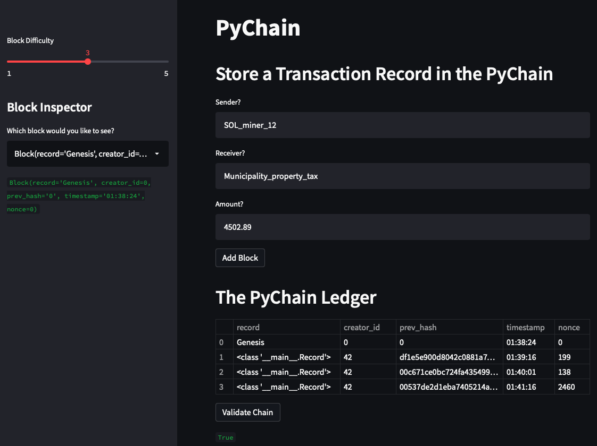
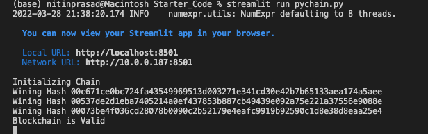

# PyChain Ledger

As a fintech engineer, working at one of the five largest banks in the world. I am acting as the lead developer on the decentralized finance team. My task was to build a blockchain-based ledger system, with a user-friendly web interface. This ledger allows partner banks to conduct financial transactions (that is, to transfer money between senders and receivers) and to verify the integrity of the data in the ledger.

1. In this program, a new data class named `Record` is present. This class will serve as the blueprint for the financial transaction records that the blocks of the ledger will store.

2. The new data class to store the Sender, receiver and amount data, is called `Record`.

3. A Streamlit interface has been initialized.

4. The PyChain Ledger has been tested by Storing Records.

---
# Screenshots

## Streamlit Output

## Winning Hash Output

---
## Submission details

* Github repository created: blockchain_hw

* Link to your GitHub project submitted to Bootcamp Spot.

---

© 2021 Trilogy Education Services, a 2U, Inc. brand. All Rights Reserved.
